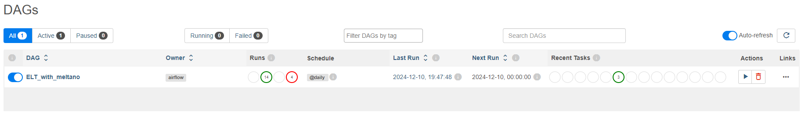
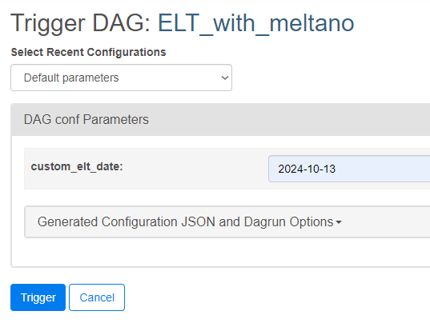
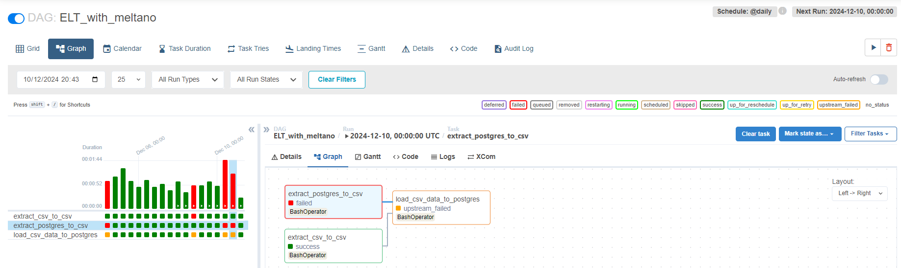
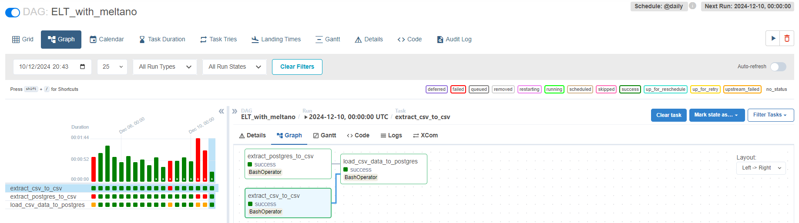
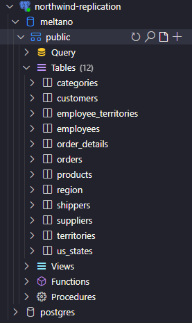
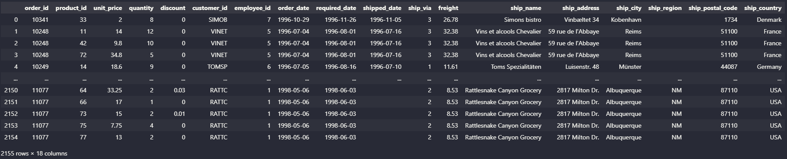

# Meltano ELT Challenge

This project is a solution to the [Indicium Tech Code Challenge](https://github.com/techindicium/code-challenge/tree/main), which focuses on building a data pipeline to replicate data from multiple sources into a unified PostgreSQL database. The challenge involves:

- Extracting data from a PostgreSQL database and a CSV file.

- Writing this data to a local filesystem, ensuring clear separation for each source, table, and execution day.

- Loading the data from the local filesystem into a PostgreSQL database.

- he pipeline must be idempotent, handle failures gracefully, and allow reprocessing for specific days by passing a date parameter.

## Directory Structure

```
README.md               # Project documentation
├── docker              # Docker configuration files
├── docker-compose.yaml # Docker Compose configuration
├── extract             # Extraction configurations
├── meltano.yml         # Meltano configuration file
├── notebook            # Jupyter notebooks for analysis
├── orchestrate         # Orchestration scripts such as DAGs and Airflow
├── output              # Local filesystem output data
├── plugins             # Meltano plugins
├── requirements.txt    # Python dependencies
├── ruff.toml           # Ruff linter configuration
```

## Pipeline Structure

The solution follows a two-step process:

### Extract Data to Local Filesystem

Data from each source (PostgreSQL and CSV) is extracted daily and stored in the local filesystem.

Files are stored in a structured format:

```text
./output/source=csv/extracted_at=2024-01-20/2024-12-10.T014141.csv
./output/source=postgres/extracted_at=2024-01-20/table=public-categories/2024-12-10.T014028.csv
```

All tables from the PostgreSQL source are extracted, even if not directly used in the final result query.

Parquet is a better file format choice due to its compression and preservation of data types compared to CSV. However, the tap and target plugins for Meltano are not as robust or well documented for Parquet as they are for CSV. Therefore, CSV was preferred in this case.

### Load Data into PostgreSQL

Data stored on the local filesystem is loaded into the target PostgreSQL database.

## Deliverables

A working pipeline capable of:

- Extracting data from PostgreSQL and CSV.

- Storing the data in a structured local filesystem.

- Loading the data into a unified PostgreSQL database.

- Evidence of a successful query showing orders and their details.

- Clear documentation and instructions for running the pipeline.

# Running the Code

This code can be executed locally. Next steps will provide the means to execute it.

## Tools

To meet the requirements of the challenge, the following tools are used:

- Scheduler: Apache Airflow

- Data Loader: Meltano

- Database: PostgreSQL

## Prerequisites

- **Docker:** Ensure Docker and Docker Compose are installed.

- **Python Environment:** Install dependencies listed in requirements.txt with ```pip install -r requirements.txt```. This project was tested with Python 3.10.12.

- **Environment Variables:** Configure the .env file based on .env-example. To generate the .env file, copy the provided .env-example file and fill in the appropriate values. Example:

    ```bash
    cp .env-example .env
    ```

    Then, edit the .env file to include your specific database credentials, as shown below:

    ```
    # Source DB config
    SOURCE_POSTGRES_DB=meltano
    SOURCE_POSTGRES_USER=meltano_user
    SOURCE_POSTGRES_PASSWORD=meltano_password

    # Target DB config
    TARGET_POSTGRES_DB=meltano
    TARGET_POSTGRES_USER=meltano_user
    TARGET_POSTGRES_PASSWORD=meltano_password
    ```

## Setup

Databases should be running for the ELTs to work.

1. Start Docker Services

    To start the necessary Docker services, run:

    ```bash
    docker compose up -d
    ```

    To stop and remove volumes, run:

    ```bash
    docker compose down -v
    ```

2. Load Environment Variables

    To load environment variables from .env to your bash, execute:

    ```
    set -a
    source .env
    set +a
    ```

    This assures that your envs will not be stores into the bash command history.

## Commands

You can manually test the ELT by executing the following commands.

### Extract Data

First line execute the tasks, second line execute the job that execute the tasks.

**From CSV:**

```bash
MELTANO_ENVIRONMENT=extract SOURCE=csv DATESTAMP=$(date +%Y-%m-%d) meltano run tap-csv target-csv
MELTANO_ENVIRONMENT=extract SOURCE=csv DATESTAMP=$(date +%Y-%m-%d) meltano run extract_csv
```

**From PostgreSQL:**

```bash
MELTANO_ENVIRONMENT=extract SOURCE=postgres DATESTAMP=$(date +%Y-%m-%d) meltano run tap-postgres target-csv
MELTANO_ENVIRONMENT=extract SOURCE=postgres DATESTAMP=$(date +%Y-%m-%d) meltano run extract_postgres
```

### Load Data

EXTRACTED_AT must match the DATESTAMP of the outputs.

**Load extracted data into PostgreSQL:**

```bash
MELTANO_ENVIRONMENT=load SCHEMA=public EXTRACTED_AT=$(date +%Y-%m-%d) meltano run tap-csv target-postgres
```

## Orchestrate with Airflow

An Airflow DAG was manually created to run the pipelines. To interact with this DAG you must start airflow, configure it and then instantiate the webserver and the scheduler.

### Initialize Airflow

```bash
meltano invoke airflow:initialize
```

### Create Admin User

```bash
meltano invoke airflow users create -u admin@localhost -p password --role Admin -e admin@localhost -f admin -l admin
```

### Start Airflow Services

Start the webserver:

```bash
meltano invoke airflow webserver
```

Start the scheduler:

```
meltano invoke airflow scheduler
```

If everything worked accordingly, Airflow must be accessible in your browser by <http://localhost:8080>.

### Running the DAG

When you acess airflow with your credentials, you must see the DAG ELT_with_meltano like in the image bellow.



You can start or pause the DAG orchestration by toggling the button on the left, or trigger it manually by clickin the "play" button in "Actions".

This will prompt for trigger parameters. If you want to execute the ELT on a specific date on the past, you can provide it on the format "YYYY-mm-dd". Leaving it blank will get the instant date in UTC.



Accessing the DAG you can observe logs and task execution times. For instance a task can fail. 

For this DAG, if the initial tasks fail the upstream will fail too like in the image below.



You can manually select the task represented by a small square on the left and click "Clear Task", this will retrigger this task and hopefully it will be sucessfull on the next run, the result should be seem like the image below.



The result should be the data replicated to Postgres. A tool like [VS Code JDBC extension](vscode:extension/cweijan.vscode-database-client2), Dbeaver or PGAdmin should provide the following table structure on the replicated database:



**NOTE:** customer_customer_demo and customer_demographics will not appear as they don't have any data.

## ELT Result Testing

Inside the notebook directory, you will find s [Jupyter notebook](./notebook/query_data.ipynb) designed to validate and test the data pipeline. The script is specifically tailored to verify the data in the replication/destination database by running a query. Use these notebooks to confirm that:

- The extracted data is properly loaded into the target database.

- Orders and their details can be queried and match the expected results.

If you run the notebook, the following output should be exhibited:



This result represents the INNER JOIN of the "order details" and "orders", so only orders that have details are exhibited.

## Notes

- Ensure the .env file is correctly configured before running commands.

- Update the MELTANO_ENVIRONMENT, SOURCE, SCHEMA, and other variables as needed for your specific use case.

- The pipeline ensures idempotency, and any failures will clearly indicate which step requires reprocessing.

# Development

To develop features to this project, lintint and formatting must be done.

## Linting and Formatting

This project uses Ruff for linting Python code. Ruff is a fast Python linter that integrates checks from various tools like Pyflakes, pycodestyle, and more. The ruff.toml file in the project root defines the configuration for Ruff. Below are the steps to lint and fix code:

### Lint the Code

Run Ruff to identify issues in the code:

```bash
ruff check .
```

Fix the Code

Run Ruff with the --fix flag to automatically fix issues:

```bash
ruff check . --fix
```

The configuration in ruff.toml specifies the following:

- **Line Length:** 79 characters.

- **Selected Rules:** Includes checks for pycodestyle (E), Pyflakes (F), pyupgrade (UP), and isort (I).